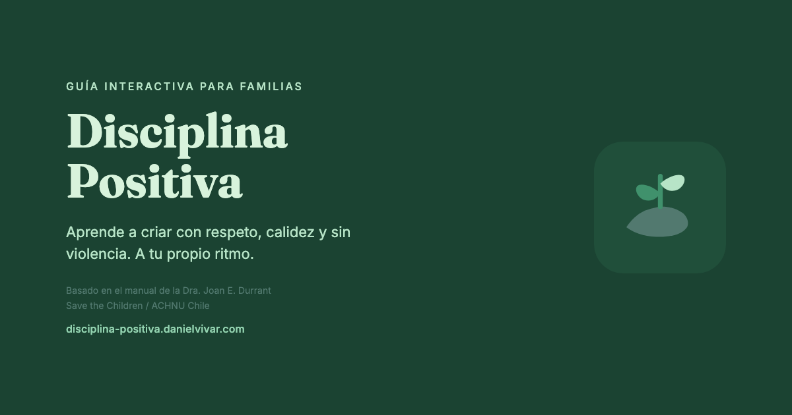

# Disciplina Positiva



> "Disciplina Positiva" means "Positive Discipline" in Spanish. The site content is currently in Spanish, with i18n support built in for adding more languages.

Live at [disciplina-positiva.danielvivar.com](https://disciplina-positiva.danielvivar.com).

An interactive learning site for parents who want to learn about positive discipline. Based on the manual by Dr. Joan E. Durrant, adapted by ACHNU Chile (Save the Children).

Parents navigate through chapters, complete reflection exercises at their own pace, and can print a personal parenting journal with their responses.

## Stack

- [Astro](https://astro.build) — static site generation
- [Svelte 5](https://svelte.dev) — interactive components (exercises, navigation, progress tracking)
- [Tailwind CSS v4](https://tailwindcss.com) — styling
- [TinaCMS](https://tina.io) — git-based CMS with visual editing
- [Vercel](https://vercel.com) — hosting

## Development

```bash
npm install
npm run dev
```

This starts TinaCMS and Astro together. The site is at `localhost:4321` and the CMS panel at `localhost:4321/admin/index.html`.

## Content structure

Content lives in `src/content/es/` as MDX files. Each chapter has frontmatter (title, order) and inline exercises embedded as interactive components.

Exercise progress is saved to localStorage — no accounts or backend needed.

## Adding a new language

1. Create a content folder (e.g. `src/content/en/`) with translated MDX files
2. Create a UI strings file (e.g. `src/i18n/en.json`)
3. Add a collection in `tina/config.ts`

## Commands

| Command | Description |
| :-- | :-- |
| `npm run dev` | Development server (TinaCMS + Astro) |
| `npm run build` | Production build |
| `npm run preview` | Preview build locally |

## License

The original content is a translation and adaptation of "Positive Discipline: What it is and how to do it" by Joan E. Durrant, published by Save the Children.
